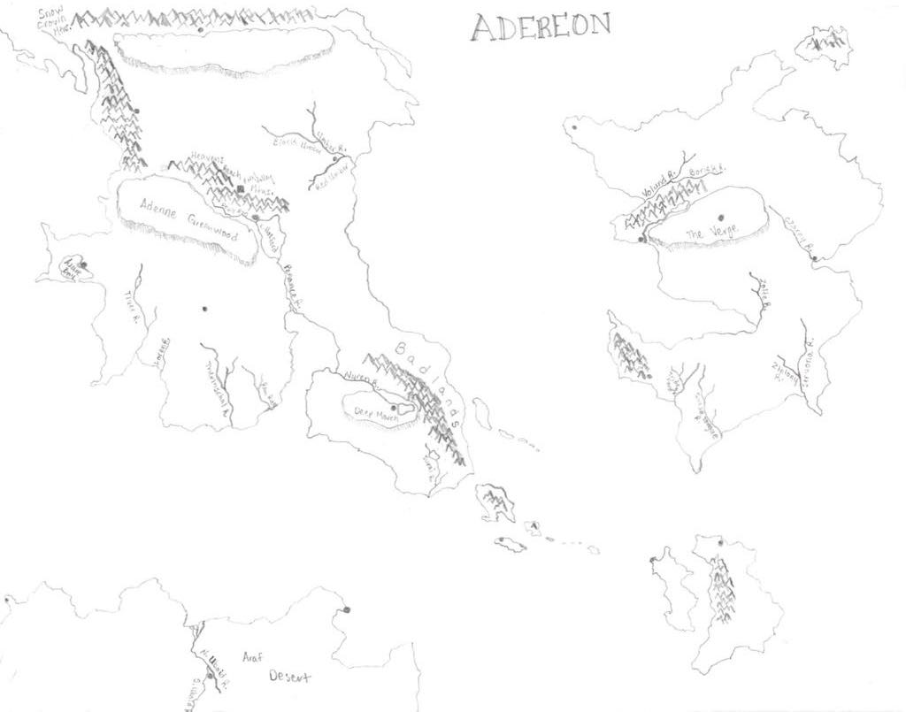

# The Continents of Adereon: Methods for Creating a Fantasy Map

## Table of Contents

<!-- TOC depthTo:3 -->

- [Methods for Creating a Fantasy Map](#methods-for-creating-a-fantasy-map)
  - [Table of Contents](#table-of-contents)
  - [Overview](#overview)
  - [Coordinate System and Projection](#coordinate-system-and-projection)
  - [Data Creation](#data-creation)
    - [Contextualizing](#contextualizing)
    - [Georeferencing](#georeferencing)

<!-- /TOC -->

## Overview

The three continents in the known world of Adereon have, to this day, never been mapped in a geographic information system.

In this document, I'll detail some of the key considerations and techniques that went into making a spatial database -- and a few maps to go along with it -- of my friend Nate's homebrewed Dungeons & Dragons universe.  Just a note: this map was creatively co-authored with my friend Nate, who is the brains behind most of the fantasy stuff. As such, I will sometimes refer to him in the mapmaking process.

## Coordinate System and Projection

Making a fantasy map in GIS is kind of a weird endeavor from the start. It complicates the most basic pair of principles that cartographers and geographers deal with: namely, coordinate systems and projections. If I wanted this map to be spatially sound (for example, measuring distance in miles from one city to the next), it would have to be properly projected -- which first means figuring out how large the globe is. Instead of creating my own coordinate system from scratch, I suggested to Nate that we use an established one, to which he was amenable.

Nate and I established that the size of one continent in Adereon was roughly equivalent to the territory of Nebraska. Unfortunately that was going to leave way too much empty space out there if we used a GCS based on Earth. Considering, Nate was agreeable to a conceptual globe roughly the size of our Earth's moon, whose circumference is about 6,800 miles and is a much more reasonable hunk of territory for a D&D campaign.

There is also a GSC available for the moon -- GCS_Moon_2000 -- and even a few projections. Great! So this is what I ran with when selecting a coordinate system.

I suppose what I am doing, then, could be considered [selenographic mapping](https://en.wikipedia.org/wiki/Selenographic_coordinates). Super!

## Data Creation

With a coordinate reference system selected, the next step was data creation. Here, I break down my process of data creation in a few steps.

### Contextualizing

The original "data" is shown below.

[Figure 01](https://github.com/itspangler/Adereon/blob/master/original_adereon_maps/adereon-topo-map.jpg).

It's just a hand drawn map of an imaginary group of continents and water features, but we might think of this data in the same way we would treat an old map whose entire extent needed to be digitized.

In order to familiarize myself with the Moon's coordinate system and make sure it worked, I downloaded some shapefiles of different features on Earth's moon from the [Lunar Reconnaissance Orbiter Camera](http://lroc.sese.asu.edu/about), or LROC. Washington University in St. Louis's [Lunar Orbital Data Explorer](https://ode.rsl.wustl.edu/mars/coverage/ODE_Moon_shapefile.html) also has interesting lunar data, but it was much less useful for my purposes.

Specifically, I downloaded the the line  feature ["Wrinkle Ridges"](http://wms.lroc.asu.edu/lroc/view_rdr/SHAPEFILE_WRINKLE_RIDGES) point feature ["Anthropogenic Features"](http://wms.lroc.asu.edu/lroc/view_rdr/SHAPEFILE_ANTHROPOGENIC_OBJECTS) and .

### Georeferencing
