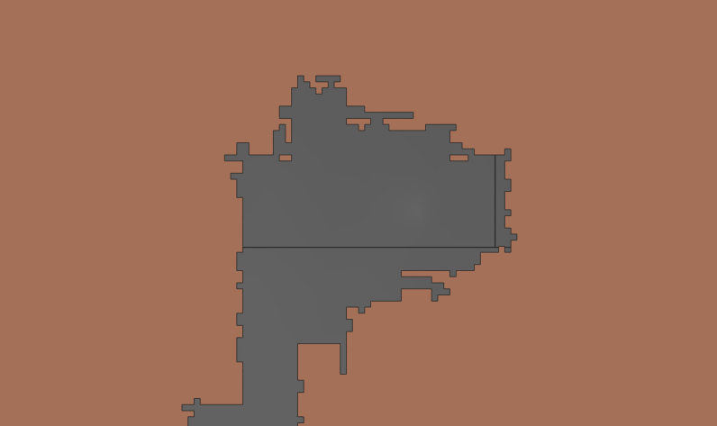

# The Continents of Adereon: Methods for Fantasy Mapping

## Table of Contents

<!-- TOC depthTo:3 -->

- [The Continents of Adereon: Methods for Fantasy Mapping](#the-continents-of-adereon-methods-for-fantasy-mapping)
  - [Table of Contents](#table-of-contents)
  - [Overview](#overview)
  - [Coordinate System and Projection](#coordinate-system-and-projection)
  - [Data Creation](#data-creation)
    - [Finding a base map](#finding-a-base-map)
    - [Georeferencing](#georeferencing)
    - [Geoprocessing](#geoprocessing)
      - [Vectorize the Raster](#vectorize-the-raster)
      - [Dissolve vectorized map](#dissolve-vectorized-map)
      - [Create background and subtract difference](#create-background-and-subtract-difference)
      - [Union and Dissolve](#union-and-dissolve)
      - [Smoothing through buffer-debuffer](#smoothing-through-buffer-debuffer)
    - [Georeferencing II: The More Difficult One](#georeferencing-ii-the-more-difficult-one)
  - [Conclusion and Reflection](#conclusion-and-reflection)

<!-- /TOC -->

## Overview

In this document, I'll detail some of the key considerations and techniques that went into making a spatial database -- and a few maps to go along with it -- of my friend Nate's homebrewed Dungeons & Dragons universe.

## Coordinate System and Projection

A fantasy GIS is kind of a weird endeavor from the start, not least because it complicates the most basic pair of principles that cartographers and geographers deal with: namely, coordinate systems and projections. If I wanted this map to be spatially sound (for example, measuring distance in miles from one city to the next), it would have to be properly projected -- which first means figuring out how large the globe is. Instead of creating my own coordinate system from scratch, I suggested to Nate that we use an established one, to which he was amenable.

Nate and I established that the size of the western continent in Adereon was roughly as long as the territory of Nebraska (i.e., 430 miles from the west coast to the east coast). Unfortunately that was going to leave way too much empty space out there if we used a GCS based on Earth. Considering, Nate was agreeable to a conceptual globe roughly the size of our Earth's moon, whose circumference is about 6,800 miles and is a much more reasonably sized big blue marble, so to speak, for the purposes of a D&D campaign.

There is, luckily, a GCS available for the moon -- GCS_Moon_2000 -- so this is what I ran with when selecting a coordinate system.

I suppose what I am doing, then, could be considered [selenographic mapping](https://en.wikipedia.org/wiki/Selenographic_coordinates). Super!

## Data Creation

With a coordinate reference system selected, the next order of business was data creation. Here, I break down my process of data creation in a few different components.

* I began with contextualizing the data, by which I mean I downloaded some other lunar data to create a map extent and get myself situated.
* Next, referring to instructions from Lab 6, I georeferenced the scanned map of Adereon.
* Finally, I did a little bit of geoprocessing (a combination of raster and vector tools) in order to save myself some time on the manual labor of drawing the continents. As it happens, this did not save me any time at all but was an interesting rabbit hole. In the following sections I'll break down each of these data creation steps.

### Finding a base map

The original "data" is shown below: three continents, some islands, forests and mountains and rivers and oceans.

*Figure 01: Original map of the known world of Adereon, where this idea began*

It's just a scanned and hand drawn map of an imaginary region, but we might think of this data in the same way we would treat an old map whose entire extent needed to be digitized.

The data I am creating does not need to be perfect; indeed, it's a dataset of imaginary topographies, so no harm done if it's a few miles off. Nate and I had agreed that the western continent was roughly equivalent to Nebraska in length.

In order to determine where my data would be drawn, and at what scale, I needed to find a base map. I downloaded some files of different features on Earth's moon from the [USGS](https://webgis.wr.usgs.gov/pigwad/down/moon_dl.htm), which could be used to determine the extent of what I'd be mapping. Specifically, I downloaded (1) a raster file of the moon, and (2) a vector file of the moon's quadrants. They each covered the moon's full extent and thus serve as a base map in my fantasy GIS.

*Figure 02: Full extent of the moon/my mapping territory*

I selected a few quadrants to georeference against

*Figure 03: My selected extent for Adereon*

On to georeferencing!

### Georeferencing

Replicating the instructions from Lesson 6 made this section rather simple. The file _adereon-topo-map.jpg_, which is the original map in Figure 01 drawn by Nate, is an unreferenced image that has no coordinate information with which a GIS can place size or location (essentially the same as _sidewalk.jpg_ from Lesson 6). As such, I imported _adereon-topo-map.jpg_ into the GDAL Georeferencer in the IAU Moon 2000 Geographic Coordinate System. Since I was only georeferencing to get the topo map *somewhere* in QGIS, rather than georeferencing it against specific features, it was simple to do and I just approximated 5 points as best I could. The result can be seen below.

*Figure 04: Georeferenced Adereon topo map*

I slightly distorted the original map in order to leave more space at the bottom for future world building stuff.

### Geoprocessing

This is where things got a little hairy. Instead of manually digitizing all of the continents, I thought it would be an interesting experiment to automate the workflow. The following section details my attempt to do so, and explains the raster/vector tools I utilized.

#### Vectorize the raster

First, I ran the "Polygonize" tool, located in "Raster --> Conversion." It's part of the GDAL library and after quite a bit of troubleshooting I was able to get the tool to work.

*Figure 05: Vectorized map of Adereon*

Yikes -- this has a bunch of issues and I had my work cut out for me. In order to generate a vector polygon of continents with a clear boundary that was not composed of ugly right angles, my next step was to concatenate all of these messy records (there are over 100,000) into a single polygon.

#### Dissolve vectorized map

The Dissolve tool is good for this. I deleted the big background polygon, and after setting my geoprocessing preferences to "ignore features with invalid geometry," I ran the Dissolve tool.

*Figure 06: Dissolved vectorized map of Adereon*

#### Create background and subtract difference

You'll notice in Figure 06 that there are a bunch of empty spaces; the Dissolve tool overlooked a number of invalid geometries, which, in most cases, were located inside the new polygons. To infill that empty space, I first dissolved the quadrants polygon, which would serve as a vector background for the next step.

*Figure 07: Dissolved quadrants*

Next, I ran the Difference tool, using the dissolved vectorized output as an overlay.

*Figure 08: Output of Difference tool with dissolved vectorized output*

*Figure 09: Output of Difference tool without dissolved vectorized output*

After deleting the big useless polygon on the outside, my new file looked like this:

*Figure 10: Output of Difference tool*

#### Union and Dissolve

Together, these new files created the polygonal infill I needed:

*Figure 11: Difference plus dissolved vectorized output*

The Union tool joined them up nicely, into a single file:

*Figure 12: Output of Union tool*

After a quick Dissolve, the internal borders are gone and we have a vector file that somewhat resembles the original scanned topo map.

*Figure 13: Dissolve from Difference output*

#### Smoothing through buffer-debuffer

At first glance this new output looks nice -- much better at least than the original vectorization -- but upon closer inspection it still has the pesky right angles along the boundary.

*Figure 14: Pesky right angles*

I installed the "Cartographic Line Generalization" plugin but couldn't get it to work properly, so in order to smooth the rough edges of this new file I used a buffer-debuffer technique. Basically, this just means I ran a Buffer tool twice: first, I ran a Buffer with a distance of 1 to soften/smooth the edges, and second, I ran a Buffer with a distance of -1 to reduce the size. Below is the smaller (second) buffer overlaid on the larger (first) buffer:

*Figure 15: Result of buffer-debuffer technique*

When set beneath the original topo map, this doesn't look too bad! And it fixed the donut holes to boot.

*Figure 16: New data beneath original topo map*

And here it is by itself:

*Figure 17: Data for Adereon generated by raster to vector workflow*

Now, admittedly, this data kind of looks like somebody took a bunch of small bites out of each continent's boundary. My workflow has a few drawbacks: it missed some of the detail around the coasts which excluded an entire continent from being generated, it connected a few landmasses that shouldn't have been connected, and it looks way less organic than the following image that I digitized before trying this whole geoprocessing workflow:

*Figure 18: One of the continents, digitized by hand*

All things considered, I definitely could have done this by hand in half the time and had a better looking dataset, but I was curious about what an automated workflow would look like for this.

And I ended up deciding that the automated workflow output's boundaries were too far off from the original and just did it by hand anyway.

*Figure 19: Final continent boundaries*

### Georeferencing II: The More Difficult One

Now that a set of boundaries had been completely created, I needed to overlay the political map that Nate had drawn. This map includes states boundaries, and while it was the same original dimensions as Nate's topo map, it is hand drawn so the boundaries do not exactly align (plus, like I indicated before, I stretched the map a bit east and west to leave more space on the bottom of the extent).

This time I added 62 points in the georeferencer, the results of which are below:

*Figure 20: Georeferencing points for political map overlaid on topo*

*Figure 21: Georeferenced political map*

And here are the results of the digitized state boundaries:

*Figure 22: Final country boundaries*

## Conclusion and Reflection

While I enjoyed working on this project and hope to add to the map as Nate continues world-building, there are a lot of things that I feel could still be improved. For one, Nate drew in a few mountain ranges that I wasn't able to represent on the map I made. I ran into issues with the GeoJSON file format, specifically when using the multipolygon to single polygon tool, and had to start using shapefiles. I didn't load things into PostGIS, which probably would have simplified a lot. I also had issues in the print layout GUI with changing fonts (a documented issue on Mac), which is why I used a combination of fonts on the map itself.

Overall, however, I'm pleased with how it turned out:

*Figure 23: Final map*

*Figure 24: Final map overlaid by Nate's original map*
