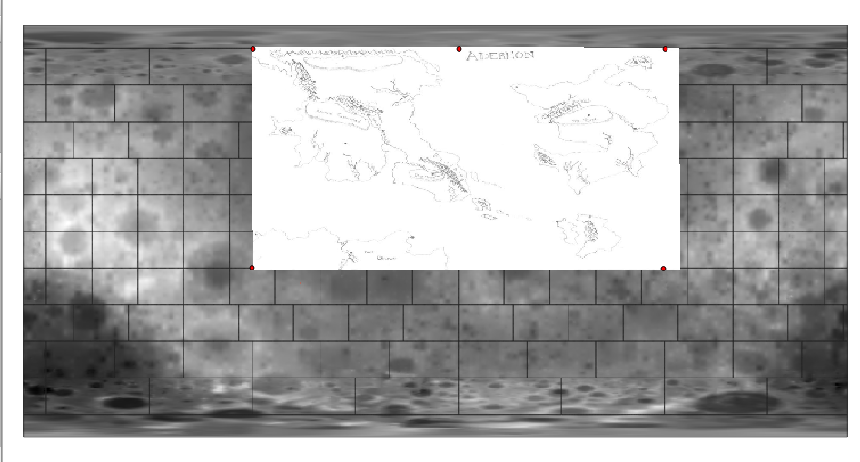

# The Continents of Adereon: Methods for Creating a Fantasy Map

## Table of Contents

<!-- TOC depthTo:3 -->

- [Methods for Creating a Fantasy Map](#methods-for-creating-a-fantasy-map)
  - [Table of Contents](#table-of-contents)
  - [Overview](#overview)
  - [Coordinate System and Projection](#coordinate-system-and-projection)
  - [Data Creation](#data-creation)
    - [Contextualizing](#contextualizing)
    - [Georeferencing](#georeferencing)

<!-- /TOC -->

## Overview

The three continents in the known world of Adereon have, to this day, never been mapped in a geographic information system.

In this document, I'll detail some of the key considerations and techniques that went into making a spatial database -- and a few maps to go along with it -- of my friend Nate's homebrewed Dungeons & Dragons universe.  Just a note: this map was creatively co-authored with my friend Nate, who is the brains behind most of the fantasy stuff. As such, I will sometimes refer to him in the mapmaking process.

## Coordinate System and Projection

Making a fantasy map in GIS is kind of a weird endeavor from the start. It complicates the most basic pair of principles that cartographers and geographers deal with: namely, coordinate systems and projections. If I wanted this map to be spatially sound (for example, measuring distance in miles from one city to the next), it would have to be properly projected -- which first means figuring out how large the globe is. Instead of creating my own coordinate system from scratch, I suggested to Nate that we use an established one, to which he was amenable.

Nate and I established that the size of the western continent in Adereon was roughly as long as the territory of Nebraska (i.e., 430 miles from the west coast to the east coast). Unfortunately that was going to leave way too much empty space out there if we used a GCS based on Earth. Considering, Nate was agreeable to a conceptual globe roughly the size of our Earth's moon, whose circumference is about 6,800 miles and is a much more reasonable hunk of territory for a D&D campaign.

There is also a GSC available for the moon -- GCS_Moon_2000 -- and even a few projections. Great! So this is what I ran with when selecting a coordinate system.

I suppose what I am doing, then, could be considered [selenographic mapping](https://en.wikipedia.org/wiki/Selenographic_coordinates). Super!

## Data Creation

With a coordinate reference system selected, the next step was data creation. Here, I break down my process of data creation in a few steps.

### Contextualizing

The original "data" is shown below: three continents, some islands, forests and mountains and rivers and oceans.

*Figure 01: Original map of the known world of Adereon, where this idea began*

It's just a scanned and hand drawn map of an imaginary region, but we might think of this data in the same way we would treat an old map whose entire extent needed to be digitized.

The data I am creating does not need to be perfect; indeed, it's a dataset of imaginary topographies, so no harm done if it's a few miles off. Nate and I had agreed that the western continent was roughly equivalent to Nebraska in length. For the sake of simplicity, I treated the original map in Figure 01 as 1,000 miles across from end to end (I figured that would approximate the western continent at 430 miles, give or take). But before blindly importing it to QGIS for georeferencing, I needed to find a spatial reference.

In order to properly georeference the scanned map of Adereon with the, I downloaded some shapefiles of different features on Earth's moon from the [Lunar Reconnaissance Orbiter Camera](http://lroc.sese.asu.edu/about) (LROC) to use as a comparison. (Washington University in St. Louis's [Lunar Orbital Data Explorer](https://ode.rsl.wustl.edu/mars/coverage/ODE_Moon_shapefile.html) also has interesting lunar data, but it was much less useful for my purposes.) Specifically, I downloaded the the line feature [Wrinkle Ridges](http://wms.lroc.asu.edu/lroc/view_rdr/SHAPEFILE_WRINKLE_RIDGES) point feature [Anthropogenic Objects](http://wms.lroc.asu.edu/lroc/view_rdr/SHAPEFILE_ANTHROPOGENIC_OBJECTS). Wrinkle Ridges covered most of the lunar territory, providing a full scope of the space I was working with, while Anthropogenic Objects provided a set of clear spatial referents that would become essential for georeferencing. Figure 02 shows the two sets of lunar data loaded in QGIS in the IAU Moon 2000 Geographic Coordinate System. This was also helpful to generally contextualize what the area looked like.

*Figure 02: Moon data in QGIS*

After playing around with the measuring tool, I found two objects that were about 1,000 miles from one another: "Luna 17" and "Luna 21." I filtered for them and found a new extent, which would ultimately become the extent for Adereon.

*Figure 03: Extent for Adereon*

On to georeferencing!

### Georeferencing

Replicating the instructions from Lesson 6 made this section rather simple. The file _adereon-topo-map.jpg_, which is the original map in Figure 01 drawn by Nate, is an unreferenced image that has no coordinate information with which a GIS can place size or location (essentially the same as _sidewalk.jpg_ from Lesson 6). As such, I imported _adereon-topo-map.jpg_ into the GDAL Georeferencer in the IAU Moon 2000 Geographic Coordinate System. Since I was only georeferencing to get the topo map *somewhere* in QGIS, rather than georeferencing it against specific features, it was simple to do and I just approximated 5 points as best I could. The result can be seen below.

*Figure 04: Georeferenced Adereon topo map*

#Fin
